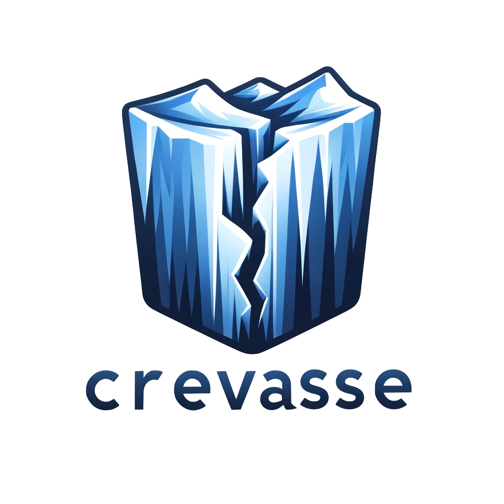

# Crevasse: Data Migration Tool for Iceberg

Crevasse is a powerful data migration tool designed specifically for Iceberg tables. It supports Groovy scripts with a Domain-Specific Language (DSL) to perform a variety of table operations, including:

* Adding columns
* Removing columns
* Updating primitive types
* Toggling nullability
* Adding table properties
* Removing table properties
* Adding partition columns
* Removing partition columns

Crevasse provides Gradle tasks to execute these migration scripts step by step, ensuring seamless migration of data structures while keeping track of the latest applied step number in the Iceberg table metadata. This enables efficient migration processes by running only the relevant new migration scripts on subsequent updates.

Additionally, Crevasse offers a Gradle task to automatically generate migration scripts based on changes made to Avro schemas, similar to the Django migration module. Instead of Django model classes, Crevasse operates on Avro schemas, making it easy to manage and update data structures as your project evolves.

With Crevasse, you can confidently manage and evolve your Iceberg tables with ease, ensuring data integrity and consistency throughout your data migration process.

